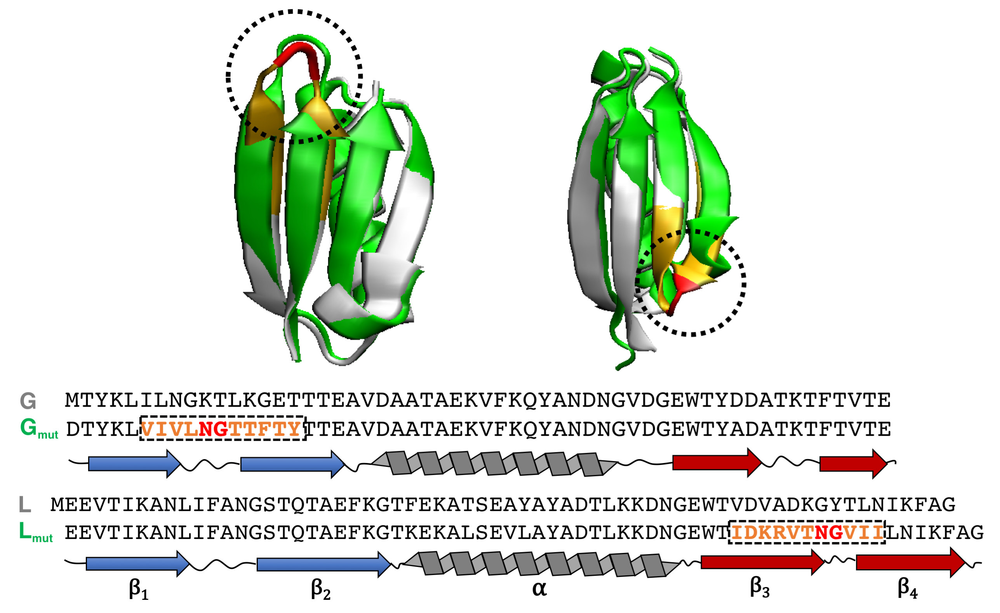

# GL_folding

* Setup file and analysis for running MELD folding simulation of protein G/L and their mutants can be found in ```run_meld```. MELD installation can be found [here](https://github.com/maccallumlab/meld). 

* MSM analysis was done with [PyEMMA](https://github.com/markovmodel/PyEMMA) shown in ```adaptive_msm```.

* AlphaFold predictions were done with local installed [ColabFold](https://github.com/sokrypton/ColabFold). ```af_GL``` contains all output structures.

